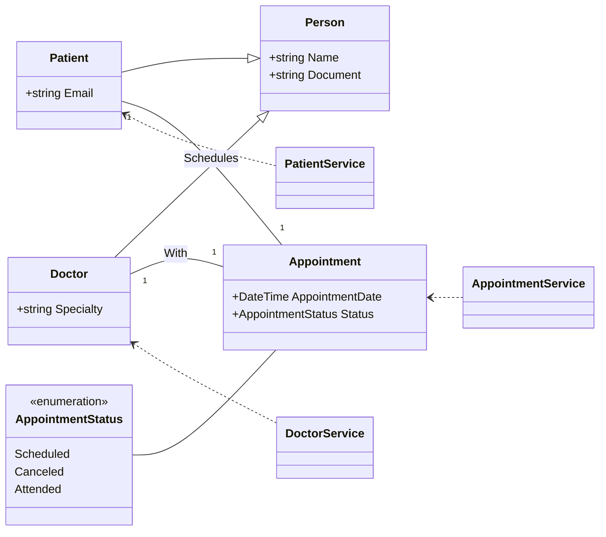

# UML Class Diagram

```mermaid
classDiagram
    direction RL
    class Person {
        +string Name
        +string Document
    }
    class Patient {
        +string Email
    }
    class Doctor {
        +string Specialty
    }
    class Appointment {
        +DateTime AppointmentDate
        +AppointmentStatus Status
    }
    class AppointmentStatus {
        <<enumeration>>
        Scheduled
        Canceled
        Attended
    }

    Person <|-- Patient
    Person <|-- Doctor
    Appointment "1" -- "1" Patient : Schedules
    Appointment "1" -- "1" Doctor : With
    Appointment -- AppointmentStatus

    class AppointmentService
    class PatientService
    class DoctorService

    AppointmentService ..> Appointment
    PatientService ..> Patient
    DoctorService ..> Doctor
```
